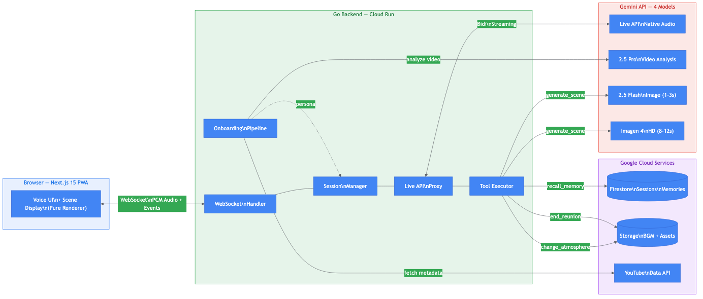

# missless — Virtual Reunion

[](https://github.com/Two-Weeks-Team/missless/actions/workflows/ci.yml)
[](https://go.dev/)
[](https://nextjs.org/)
[](https://ai.google.dev/gemini-api/docs/live)
[](https://cloud.google.com/run)
[](LICENSE)

> **그리운 사람과의 가상 재회** — YouTube 영상을 분석하여 AI가 그 사람의 성격을 재현하고, 실시간 음성 대화 + 이미지 생성 + BGM으로 몰입감 있는 재회 경험을 제공합니다.

<p align="center">
  
</p>

---

## Features

- **Voice-First Experience** — 텍스트 입력 없이 100% 음성 기반 상호작용
- **YouTube Video Analysis** — Gemini 2.5 Pro로 영상 속 인물의 말투, 성격, 표정을 분석
- **30 HD Preset Voices** — 분석 결과를 기반으로 가장 적합한 음성 자동 매핑
- **Progressive Image Generation** — Flash 프리뷰(1-3초) → Imagen 4 고품질(8-12초) 2단계 렌더링
- **Real-time BGM** — 대화 분위기에 맞춰 자동으로 배경음악 전환
- **Shareable Album** — 재회 장면을 앨범으로 생성하여 공유

---

## Architecture

```
Browser (Next.js 15 PWA)
    │ WebSocket (audio PCM + events)
    │ HTTPS (upload, health)
    ▼
Go Backend (Cloud Run)
    ├── SessionManager (state machine)
    │   └── Onboarding → Analyzing → Reunion → Album
    ├── Live API Proxy (bidirectional audio streaming)
    ├── Tool Executor (5 server-side tools)
    │   ├── generate_scene  → Progressive 2-stage image
    │   ├── change_atmosphere → BGM crossfade
    │   ├── recall_memory → Firestore search
    │   ├── analyze_user → Vision analysis
    │   └── end_reunion → Album generation
    ├── Onboarding Pipeline (Sequential Agent)
    │   ├── Stage 1: VideoAnalyzer (YouTube URL analysis)
    │   └── Stage 2: VoiceMatcher (30 preset mapping)
    └── Album Generator
    ▼
Google Cloud Services
    ├── Gemini API (Live, Pro, Flash Image, Imagen 4)
    ├── YouTube Data API v3
    ├── Cloud Firestore (sessions, personas, memories)
    └── Cloud Storage (BGM presets, generated assets)
```

---

## Tech Stack

| Layer | Technology | Version |
|-------|-----------|---------|
| **Backend** | Go | 1.22+ |
| **Frontend** | Next.js (PWA, static export) | 15 |
| **AI SDK** | google.golang.org/genai | v1.47.0 |
| **Agent SDK** | google.golang.org/adk | v0.5.0 |
| **WebSocket** | gorilla/websocket | v1.5.3 |
| **Database** | Cloud Firestore | v1.17.0 |
| **Storage** | Cloud Storage | v1.47.0 |
| **Auth** | golang.org/x/oauth2 | v0.25.0 |
| **Deploy** | Google Cloud Run | asia-northeast3 |
| **IaC** | Terraform + Cloud Build | — |

### AI Models

| Purpose | Model |
|---------|-------|
| Real-time Voice | `gemini-2.5-flash-native-audio` (Live API) |
| Quick Image | `gemini-2.5-flash-image` (1-3s) |
| Pro Image | `imagen-4.0-generate-001` (Imagen 4, 8-12s) |
| Video Analysis | `gemini-2.5-pro` |
| BGM | Preset audio files (Lyria not available in Go SDK) |

---

## Quick Start

### Prerequisites

- Go 1.22+
- Node.js 20+
- GCP project with APIs enabled (Gemini, YouTube Data, Firestore, Storage)
- gcloud CLI authenticated

### 1. Clone & Install

```bash
git clone https://github.com/Two-Weeks-Team/missless.git
cd missless

# Go dependencies
go mod download

# Frontend dependencies
cd web && npm install && cd ..
```

### 2. Environment Setup

```bash
cp .env.example .env
# Edit .env with your API keys and credentials
```

Required environment variables:
| Variable | Description |
|----------|-------------|
| `GCP_PROJECT_ID` | GCP project ID |
| `GEMINI_API_KEY` | Gemini API key |
| `YOUTUBE_CLIENT_ID` | OAuth client ID |
| `YOUTUBE_CLIENT_SECRET` | OAuth client secret |
| `STORAGE_BUCKET` | Cloud Storage bucket name |
| `SESSION_SECRET` | 32+ char random secret |

### 3. Run Locally

```bash
# Build frontend
cd web && npm run build && cd ..

# Run Go server
go run cmd/server/main.go
```

Open http://localhost:18080

### 4. Run Tests

```bash
# Go tests with race detector
go test -race ./...

# Frontend
cd web && npm run lint && npx tsc --noEmit
```

---

## Deployment

### Cloud Run (via Cloud Build)

```bash
gcloud builds submit --config deploy/cloudbuild.yaml
```

### Terraform

```bash
cd deploy/terraform
terraform init
terraform plan -var="project_id=YOUR_PROJECT" -var="gemini_api_key=YOUR_KEY"
terraform apply
```

### Docker (Manual)

```bash
docker build -f deploy/Dockerfile -t missless .
docker run -p 18080:18080 --env-file .env missless
```

---

## Project Structure

```
missless/
├── cmd/server/main.go           # Entry point
├── internal/
│   ├── config/                  # Environment config + HTTP client
│   ├── session/                 # SessionManager (state machine)
│   ├── live/                    # Live API proxy + tools + reconnect
│   ├── onboarding/              # Sequential Agent pipeline
│   ├── scene/                   # Image generation + CharacterAnchor + album
│   ├── media/                   # YouTube client + privacy + upload
│   ├── auth/                    # Google OAuth 2.0
│   ├── store/                   # Firestore session store
│   ├── memory/                  # Memory CRUD (recall_memory)
│   ├── handler/                 # HTTP/WebSocket handlers
│   ├── middleware/               # Recovery + logging
│   ├── util/                    # SafeGo wrapper
│   └── retry/                   # Exponential backoff
├── web/                         # Next.js 15 PWA
├── deploy/
│   ├── Dockerfile               # Multi-stage build
│   ├── cloudbuild.yaml          # Cloud Build pipeline
│   └── terraform/               # Infrastructure as Code
├── plan/v7/                     # Implementation specs
└── .github/workflows/ci.yml    # GitHub Actions CI
```

---

## Development

### Go Safety Rules

This project enforces strict Go safety patterns (see `plan/v7/06-GO-SAFETY.md`):

- **`util.SafeGo()`** — All goroutines must use this wrapper (panic recovery)
- **Lock ordering** — Manager(L1) → Proxy(L2) → ToolHandler(L3) → CharacterAnchor(L4) → AlbumGenerator(L5) → MemoryStore(L6)
- **Race detector** — `go test -race` is mandatory for all PRs
- **No I/O under locks** — Perform I/O outside critical sections
- **Buffered channels** — Always `make(chan T, 1)` minimum for goroutine results

### CI Pipeline

Every push/PR triggers:
1. `go vet ./...`
2. `staticcheck ./...`
3. `go test -race -count=1 ./...`
4. `go build`
5. Frontend: `tsc --noEmit` + `next lint` + `next build`

---

## License

MIT
